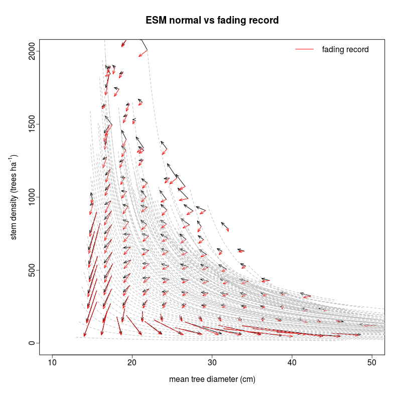
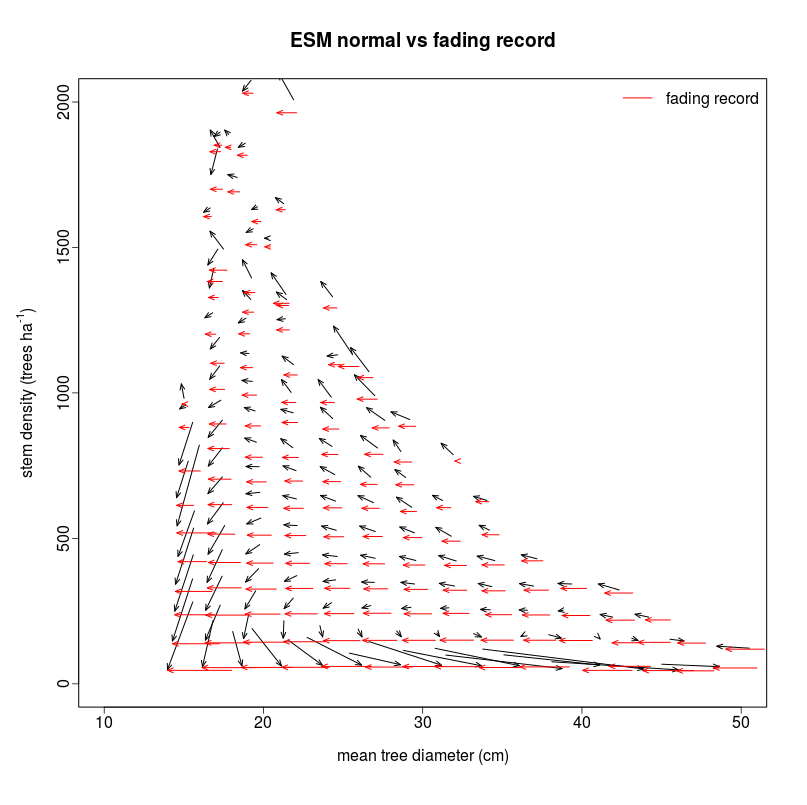
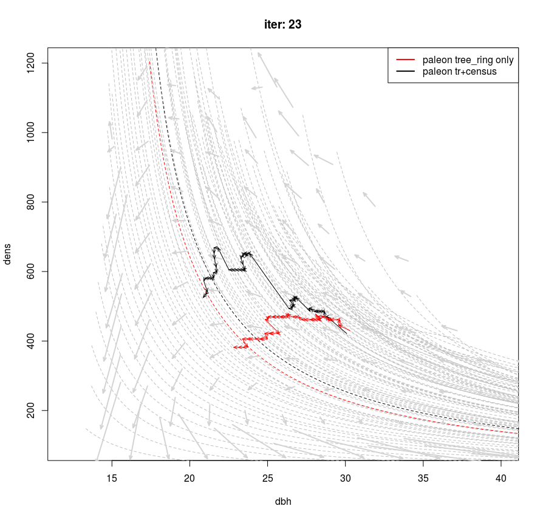
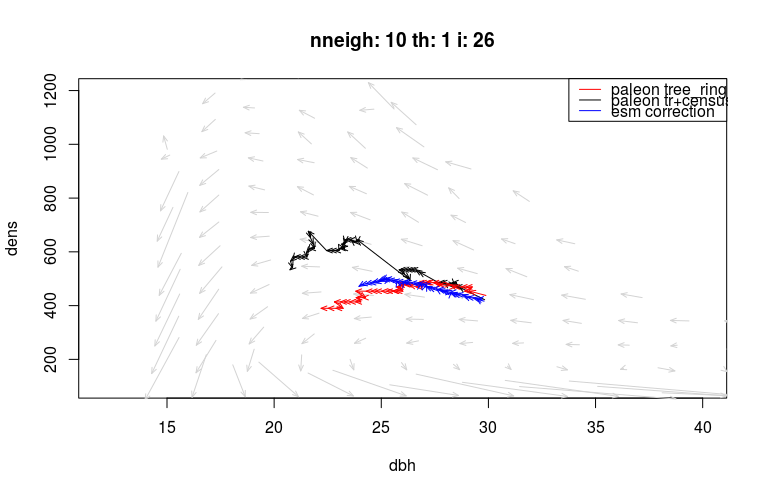
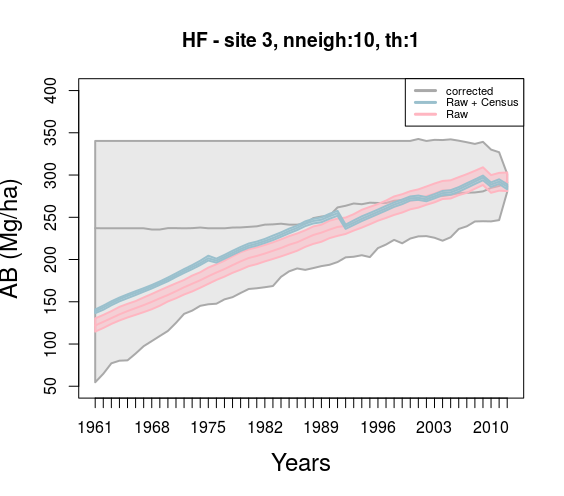
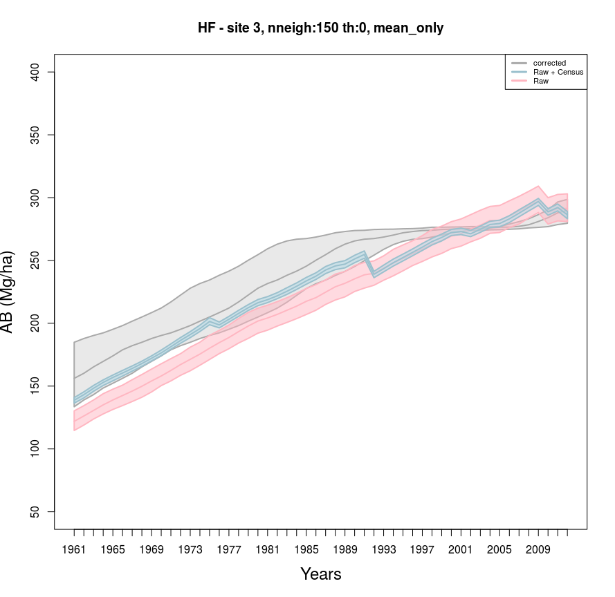
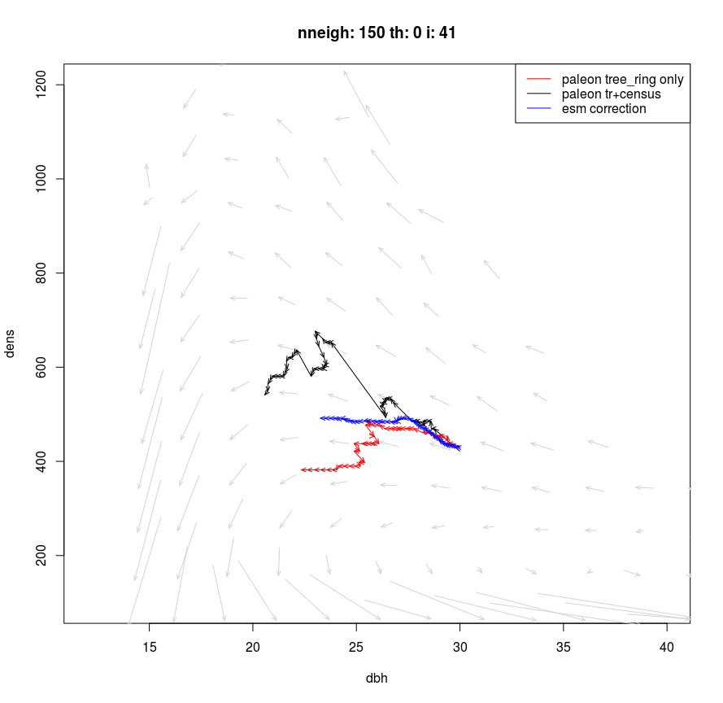

```{r setup, include=FALSE}
knitr::opts_chunk$set(echo = TRUE)
```

## Fading record correction

This document explains the workflow for PalEON tree-ring fading record correction using Empirical Succession Mapping (ESM).

First step is to extract ESM phase space data from FIA database using the `scripts/ESM_correction/fia_extract.R` script. This can only be done at BU servers currently, but resulting data objects (ESM.rds and ESM_F.rds) are on team drive.

Fill in the following paths in this script, then save and source:

```{r, eval=FALSE}
file.pft = "../../data/spcd2pft.csv"
file.normal = "../../data/ESM.rds"
file.fading = "../../data/ESM_F.rds"

source("fia_extract.R")
```
This scripts generates two ESM phase-space data. 1) Normal: same as Andrews et al. https://doi.org/10.1101/478693 2) Fading record: mimics the tree-ring data, no ingrowth and no mortality. These lines are responsible:

```{r, eval=FALSE}
  if(!fading_record){
    
    # Initial number of trees is current survivors plus those that died during the resurvey period.
    GRM[, start1tpa      := SURVIVORTPA + MORTALITYTPA                  ]
    
    # Final number of trees is current survivors plus new trees that cross the 5" threshold
    GRM[, end1tpa        := SURVIVORTPA + INGROWTHTPA                   ]
    
  }else{
    
    # no mortality
    GRM[, start1tpa      := SURVIVORTPA                   ]
    GRM[COMPONENT!="SURVIVOR", DIA_BEGIN := NA] # Set non-survivor values to NA
    
    # no ingrowth
    GRM[, end1tpa        := SURVIVORTPA              ]
    GRM[COMPONENT!="SURVIVOR", DIA_END := NA] # Set non-survivor values to NA
  }
```


Before we plot these, let's estimate the aboveground biomass (ab) values for the ESM normal plots in the present. These ab values will be used in searching similar plots (nearest neighbours) later in the workflow. Again, first fill the paths in the `scripts/ESM_correction/estimate_fia_ab.R` script and source:
```{r, eval=FALSE}
# these are rds objects created by fia_extract.R script above
file.in.normal = "../../data/ESM.rds"
file.in.fading = "../../data/ESM_F.rds"

# these are translation and allometric coeff tables respectively
fia_to_paleon   <- read.table("../../data/fia_to_level3a_v0.5.csv", heade = TRUE, sep="\t")
chojnacky_table <- read.table("../../data/level3a_to_chojnacky_v0.2.csv", header = TRUE, sep = "\t")

# the resulting data frame is saved here
save(ab_lut, file = "../../data/ab_lut.Rdata")

source("estimate_fia_ab.R")
```

Now we can plot ESM vectors (backwards) with biomass curves using the `scripts/ESM_correction/plotting_ESM4PalEON.R` script.




Here note that while plotting, we deliberately used the same starting points for both fading and non-fading arrows, otherwise in the fading-record ESM there is no ingrowth for the beginning of the arrow and there is no mortality for the head (less density, bigger DBH in present). So, it would have looked like this if you changed the following line in the plotting function to:
```{r, eval=FALSE}
arrows(meanD$diameanD,meanD$tpasumD,meanD$prevdiameanD,meanD$prevtpasumD, col=2, length=0.065, angle=22,lwd=1)
```


Now we will go throught the `scripts/ESM_correction/esm_fading_record_correction.R` script which is the main script where the correction happens. It consists of many parts, first read in everything that is needed in the calculations:

```{r, eval=FALSE}
# these were created by fia_extract.R
file.in.normal = "../../data/ESM.rds"
file.in.fading = "../../data/ESM_F.rds"

# this is the PalEON product I got from Andria during the SDA hackathon
# it has tree-ring only and tree-ring+census products for Harvard Forest, NOT corrected for PalEON sampling scheme
file.in.model  = "../../data/HF_PREDS_tree_iter_25June2019.RDS"

# translation table and allometry table
fia_to_paleon   <- read.table("../../data/fia_to_level3a_v0.5.csv", heade = TRUE, sep="\t")
chojnacky_table <- read.table("../../data/level3a_to_chojnacky_v0.2.csv", header = TRUE, sep = "\t")

# load ab lut table created by estimate_fia_ab.R above
load("../../data/ab_lut.Rdata")
```

Then there is a bit of a pre-processing and unit conversions in the script. The first important thing we do in the script is to identify the small trees (dbh<20cm) in the inner circle. Paleon sampling scheme samples only big trees (dbh>20cm) in the outer ring, but the FIA plots don't have this. To make them compatible, we will clone the small trees in the inner circle to the outer ring proportional to the area of inner circle and outer ring. To do that, we first label the small trees using the big_or_small function. This function starts from the most recent year (and loops through years towards past because a few trees appear on different years in the first couple of years, I guess because some trees were sampled at different years), if it sees a big tree (dbh > 20cm) labels it to be a big tree throughout the whole dataframe for that iteration.

```{r, eval=FALSE}
hf_tronly <- big_or_small(site_sub = hf_tronly)
```
Only `hf_tronly` (tree-ring only product) is processed by this function because tree-ring plus census product doesn't have the sampling scheme.

Then comes the loop where we correct for the PalEON sampling scheme, and where we calculate the `(dbh, dens, ab)` values for each year and iteration in both of the PalEON data products. The correction for sampling is done by cloning small trees in the inner circle to the outer ring proportional to their areas. The script `scripts/explore_Paleon_data.R` kind of validates this approach. In that script, I take the tree-ring+census data product, apply the same sampling scheme as the tree-ring only data product by removing small trees from the outer ring. Then, by treating this as a pseudo-treering-only product (with PalEON sampling scheme) I apply the (cloning) correction. Then I compare the corrected-pseudo-treering-only product to the original tree-ring+census product to see if I was able to retrieve it back (or at least, whether the values were comparable to each other). 1:1 lines showed good agreement, assuming similar number of trees in the outer ring (proportional to the area) is not too bad but it might not apply everywhere. I thinks HF plot 1 had a different number of small trees in the outer ring (not quite proportional to the area) in reality for example.

After correcting for the sampling scheme, we also calculate the `(dbh, dens, ab)` values for each year and iteration in both data products once. So that for example we can plot this:
```{r, eval=FALSE}
i <-  23  # for one of the iterations
years <- 2012:1962 # so that subscript doesn't go out of bounds

plot(12:40,seq(100,1200, length.out= length(12:40)),"n",xlab="dbh",ylab="dens",main=paste0("iter: ",i))

# add biomass curves
ab_df <- ab_lut
classes <-  seq(0, 665, by=5)
tens <- findInterval(ab_df$ab, classes)
fb <- findInterval(frec[[i]][nrow(frec[[i]]),3], classes)
cb <- findInterval(crec[[i]][nrow(crec[[i]]),3], classes)
ab_df$tens <- tens

colnames(ab_df) <- c("plt","x","y","ab", "t")
ab_df <- ab_df[,c("x", "y", "ab", "t", "plt") ]

for(t in unique(tens)){
  subdf <- ab_df[ab_df[,4]==t,]
  if(dim(subdf)[1]>4){
    a_start<-4000 #param a is the y value when x=0
    b_start<-20
    fit <-nls(y~a/(b+x), data = subdf, start=list(a=a_start,b=b_start))
    xseq <- seq(min(subdf[,1]), max(subdf[,1]), length.out=300)
    
    xnew=list(x=xseq)
    y2=predict(fit,xnew)
    if(t==fb){
      lines(xseq,y2, lty=2, col=2)
    }else if(t==cb){
      lines(xseq,y2, lty=2, col=1)
    }else{
      lines(xseq,y2, lty=2, col="gray")
    }
    
  }
}


# background to see how normal ESM phase space looks like
arrows(meanB$diameanB,meanB$tpasumB,meanB$prevdiameanB,meanB$prevtpasumB, col="lightgray",
         length=0.065, angle=22,lwd=2) 
legend("topright", legend =c("paleon tree_ring only", "paleon tr+census"), col = c(2,1), lty=1, lwd=2)

for( y in seq_along(years)){
  # non-fading arrow, we don't have this at every site
  arrows(crec[[i]][y,1], crec[[i]][y,2], crec[[i]][y+1,1], crec[[i]][y+1,2], col=1, length=0.065, angle=22)

  # fading arrow
  arrows(frec[[i]][y,1], frec[[i]][y,2], frec[[i]][y+1,1], frec[[i]][y+1,2], col=2, length=0.065, angle=22)
}

```


This is just the paleon data, no correction, just what they are. From this figure you can see how the arrows calculated from the Paleon data products tend to move in the phase space. The black trajectory (non-fading) sort of follows the normal ESM phase transitions (gray arrows in the background). The red and black dashed curves are the biomass curves that represent the tree-ring only and tree-ring+census model biomass values at 1962, 124.8 and 138.4 respectively. So the arrows don't fall on respective curves which might be OK, because curves are expected values. But this might be worth noting.

Then, there is (there supposed to be) a function that calculates the fading record arrow length from the tree-ring only (red) arrows as plotted above, and compare it to the ESM fading record arrows (the horizontal red arrows in the second plot above), get how much we need to scale the ESM non-fading (normal) arrows (the black arrows in the second plot). But as you can see from the paleon arrows in the plot above, the arrows I draw using paleon tree-ring only product (red) are not always horizontal. So I wasn't sure whether I need to consider the horizontal component only or I should work with the whole vector length. But I decided to do a free run test first anyway. Meaning, I decided to choose a starting point in the phase space from the most recent Paleon point and run ESM backwards freely to see on average what happens to the FIA plots that starts from this point in 50 years or so. Our idea was that HF, or any other particular site that we are trying to correct, has probably experienced their own conditions, so that we wanted not to have a free run but revise this trajectory that ESM tells us with the information we can get from the tree-ring only data.
 
 
 Next, there is the function `update_ab` that calculates the aboveground biomass of the FIA plots as we go back in time. So, each of the ESM arrows (first plot) represent 5 year-ish intervals. We need to rescale these arrows to find where a particular FIA plot was 1-year ago, not 5 years ago. Then, you might think we need to do that calculation once. This is a function that is called repeatedly as opposed to being calculated once before we apply the correction in a loop, because although the scaling from 5-yrs to 1-yr is static, as I mentioned above we thought about an additional scaling that represents the plot specific experience. So if it was a particularly bad year for Harvard plot, that 1-yr arrow needs to go more negative values than it would be. That information would be slightly different for 250 iterations of the paleon sample. Also, every iteration, slightly different nearest (most similar) FIA plots would be chosen, so I thought I might just call this function repeatedly in the loop. Anyway, as I said, I don't do this plot specific scaling yet. So currently all this function does is finding where the FIA plot would be 1-year ago, instead of 5-years ago.
 
 Then, I normalize the ab lookup table. Because, when paleon data product tells me where to start from n the phase space (e.g. (dbh=30, dens=429, ab=297)), I do a search for similar FIA plots in the ESM data using 3D euclidean distance, different units messes up with this nearest neighbor search.
 
```{r, eval=FALSE}
 #normalize
ab_lut_norm <- ab_lut
mins <- apply(ab_lut[,2:4], 2, min)
maxs <- apply(ab_lut[,2:4], 2, max)
ab_lut_norm[,2] <- (ab_lut_norm[,2] - mins[1]) / (maxs[1]-mins[1]) #dbh
ab_lut_norm[,3] <- (ab_lut_norm[,3] - mins[2]) / (maxs[2]-mins[2]) #dens
ab_lut_norm[,4] <- (ab_lut_norm[,4] - mins[3]) / (maxs[3]-mins[3]) #ab
 
``` 
 And, I finally have the `search_esm` function to do the nearest neighbours search using 3D euclidean distance in the normalized phase space. One thing I added extra was to have a threshold for biomass. The ESM data is very noisy, you can get very different biomass values for different plots that has the same dbh and dens (maybe we should filter the FIA database more for the paleon domain only?). So I first subset the FIA data such that the remaining plots have `+/- th` (threshold) biomass of the biomass that I'm looking for. For an example, see the 10 nearest neighbors of this  point `(dbh=30, dens=429, ab=297)` in the phase space, with or without subsetting according to this threshold:
 
```{r, eval=FALSE}
 # with threshold, th = 1
 
          plt_cn      dbh     dens       ab
 100203987010478 31.36900 416.3853 297.0251
 109829095010661 30.91543 416.3853 296.0499
 118182031010661 30.12090 431.2562 296.5510
  16264790020004 30.61547 446.1271 296.9807
 168989011010661 30.42745 431.2562 297.4982
 220871205010661 29.38206 460.9980 297.5686
 222468952010661 30.49881 401.5144 296.5852
 245793311010661 29.93697 431.2562 296.7781
 247104641010661 29.30832 460.9980 296.4089
  55050638010478 30.93884 460.9980 297.8761

# without threshold
          plt_cn      dbh     dens       ab
 108628275010661 29.24629 416.3853 294.8336
 118182031010661 30.12090 431.2562 296.5510
 153849286010854 30.06513 446.1271 295.5018
  15806345020004 30.23476 431.2562 292.4295
  15807226020004 30.57071 416.3853 294.3591
 168979143010661 29.53407 431.2562 293.9718
 168989011010661 30.42745 431.2562 297.4982
 173674599010854 30.26979 431.2562 293.8199
 245793311010661 29.93697 431.2562 296.7781
 258880615010854 30.24414 416.3853 299.4535
 
``` 
 
 With the threshold, especially dens values show a lot of variation, but the biomass stays in a certain range. Without the threshold, there is more variation in the biomass (ab) values, but the values seem OK for the first iteration. However, as I go backwards in time, search without threshold ends up suggesting very low biomass values. Anyway, you can turn this off too (by setting `th=0`). Overall, I think my search method might be too simplistic, maybe we need a better search method for similar FIA plots so that we can track them back in time. *This might be one of the things that messes up the whole correction workflow.*
 
 Then the loop where I apply the correction (free backward ESM run in this case) comes. I determine the threshold to be 1 `(th=1)` and number of nearest neighbours to be 10 `(nneigh=10)` first.  The algorithm goes like this:
 
 
```{r, eval=FALSE}
 1. Get the starting point from tree-ring only data product, which is the (dbh, dens, ab) values for the most recent year 
 2. Find nneigh nearest neighbours (e.g. 10 most similar FIA plots in terms of (dbh, dens, ab) values we get at step 1 in the FIA phase space [beginning of the first arrow]
 3. Find what the (dbh, dens, ab) values of these FIA plots would be a year ago (use update_ab function)
 4. Save those values for the next year. There will be nneigh (dbh, dens, ab) values if we are not tracking the mean only. [end of the first arrow]
 5. Previous iterations (dbh, dens, ab) values became current (dbh, dens, ab) values [beginning of the second/next arrow]
 6. Find nneigh nearest neighbours for each of these nneigh points we found in the previous iteration. So we end up with nneigh x nneigh plots here (unless we are tracking the mean only, then we again only have nneigh plots, see below)
 7. Update them all, i.e. find where they would be previous year (use update_ab function)
 8. If we keep doing this, number of plots that needs tracking will increase exponentially, so we can either thin or maybe take the mean. Just sampling one of these (thinning) did not really worked well for me, so I take the mean.
 9.  Save those values for the next year. There will be nneigh (dbh, dens, ab) values. [end of the second/next arrow]
 10. go to step 5 until you loop over all years
 11. then go to step 1 for the next iteration
``` 
While going through this loop, I plot some diagnostic plots as well, like this one:

Blue ones are the mean arrow (I'm tracking multiple trajectories), but it usually shows me whether the blue trajectory got stuck or went too fast (to the lower biomass values). Legend says "esm correction" but again this is just a free backwards run, only the starting point is informed by paleon product.


Finally, I draw the time series version with the CIs:




ESM CIs are too wide, looks like anything can happen. One can try different (or no) thresholds, different number of nearest neighbours, but I don't think this version quite works (unless there is a bug of course). I didn't think including site specific scaling factors (if it was a bad year for HF, make the arrow longer thing) would fix this, so I didn't bother.

One other thing I tried was to store and track mean trajectory only. I do this by setting `mean_only = TRUE`, then in step 4 of the algorithm instead of storing all nneigh plots individually, I take their mean, store and use that as the next starting point. This is not what we agreed initially, but as we are now thinking about something-that-works-but-not-perfect, this approach also could be played with. Here is the CIs using this setup (no threshold, 150 nearest neighbours):


I feel like, this looks more promising. Again we can try different `th` and/or `nneigh` values to see how this changes. I chose 150 nearest neighbours because the gray vectors in the background are plotted by binning FIA data and each bin has at least 100 plots (bin.min.n = 100). So main trends only appear if you are looking >100 plots? I haven't tried the other approach with 150 neighbours because then it gets reeeally slow. Maybe site specific scaling can also be applied with this setup now. 



