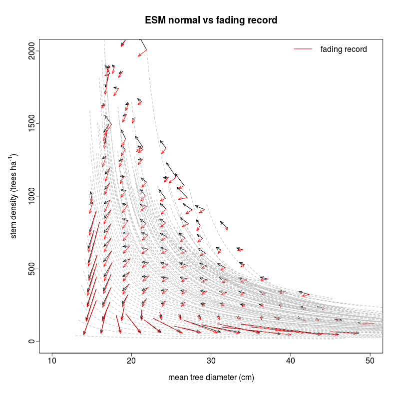

# fading-record
Test of the fading record correction using the FIA stem density versus mean stand diameter phase space diagram.

# /scripts/explore_Paleon_data.R
This script tests the tree cloning method to "correct" the paleon sampling which ignores the small trees in the outer ring.

# /scripts/ESM_correction
PalEON tree-ring fading record correction using Empirical Succession Mapping (ESM)

1. First step is to extract ESM phase space data from FIA database : fia_extract.R 
2. Fit allometries and prepare the AB lookup table : estimate_fia_ab.R
3. You can plot backward ESM vectors with biomass curves: plotting_ESM4PalEON.R

4. ...
